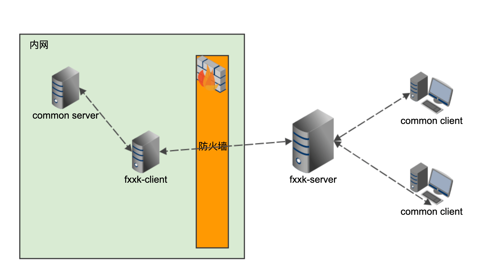

# Fxxk



#### 使用姿势

```bash
# 启动 server, 8081 为 fxxk-client 连接的端口，8082 为 common-client 连接的端口
./server -listen=:8081 -proxy-listen=:8082

# 启动 client
./client --server=fxxk-server-ip:8081 -targetAddr=common-server-addr
```
